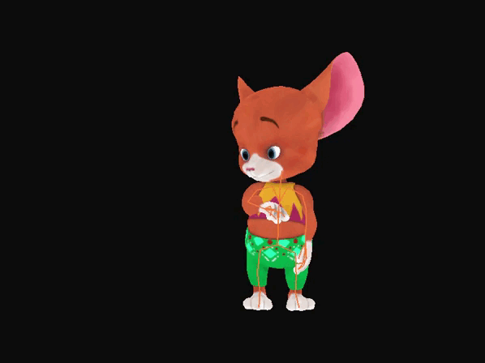
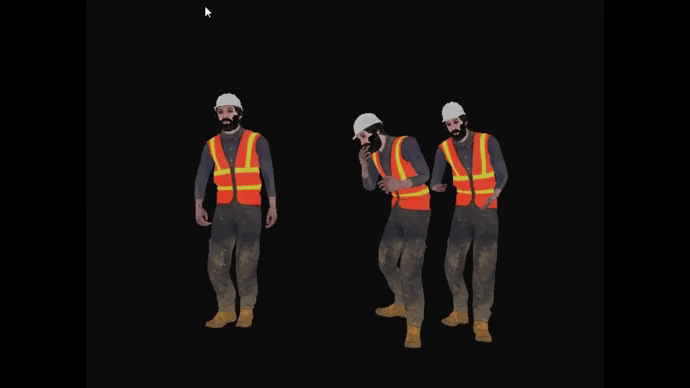

# Introduction

动画是游戏开发中的一门重要的技术，它可以让游戏更加生动，更加有趣。掌握一门技术的最好的方式，往往就是从底层开始去实现。OpenGL作为一门适合初学者的图形学API，可以让我们在实现动画时，不用去考虑窗口生成等这些繁琐的事情，不用再去学MFC，QT等，就可以直接在窗口上生成动画。

PS： OpenGL之前有一定的基础，所以更好上手，如果之前没接触过OpenGL，可以先看看[OpenGL入门教程](https://learnopengl-cn.github.io/)。

## 准备工作

### 1. 安装OpenGL环境
	
参考OpenGL入门教程，安装的库有：

		1. GLFW  （用于创建窗口和处理用户输入）
		2. GLAD  
		3. GLM	（数学库）
		4. stb_image.h （图像加载库）
		5. Assimp  （模型加载库）

### 2. 模型下载

模型下载地址：

	https://free3d.com/3d-models/obj
	https://www.mixamo.com/

### 3. 项目结构

	--- include   库头文件
		|---glad
		|---GLFW
		|---glm
		|---assimp
	--- lib
	--- learnopengl 模型的类的相关文件，OpenGL入门教程有相应的源码的教程
	--- resources 下载的模型资源
	--- Shaders  着色器代码
	    

## 动画原理
	
推荐知乎或者CSDN上的相关文章，这里不做过多的介绍，OpenGL上也有相关知识。

## Assimp

Assimp加载模型后aiNode结构

	 
骨骼的树状结构

需要注意Assimp模块加载模型后aiNode的连接的树状结构和骨骼节点的树状结构是不一样的。具体表现是每个骨骼的aiBone必然对应了一个aiNode节点，反之则不成立。
所以在加载模型后，需要对aiNode的树状结构进行转换，转换成骨骼节点的树状结构，这样才能在动画中使用骨骼节点。
以下是将aiNode的树状结构转换成骨骼节点的树状结构的代码：

	void ReadHierarchyData(BoneNodeData& dest, const aiNode* src)
	{
		assert(src);

		bool isBone = false;
		std::string NodeName(src->mName.data);
		if (m_BoneInfoMap.find(NodeName) != m_BoneInfoMap.end())    // if the node corresponds to a bone/skeletal joint
		{
			dest.name = src->mName.data;
			dest.transformation = AssimpGLMHelpers::ConvertMatrixToGLMFormat(src->mTransformation);
			isBone = true;
		}
		for (int i = 0; i < src->mNumChildren; i++)
		{
			if (isBone) {
				BoneNodeData newData;
				ReadHierarchyData(newData, src->mChildren[i]);
				if (newData.name != "") {
					dest.children.push_back(newData);     //adding the bone to the hierarchy, if the bone is valid.
				}
				
			}
			else {
				ReadHierarchyData(dest, src->mChildren[i]);
			}
			
		}
	}

## 效果
	
### 1. 显示骨骼

### 2. 动画融合

